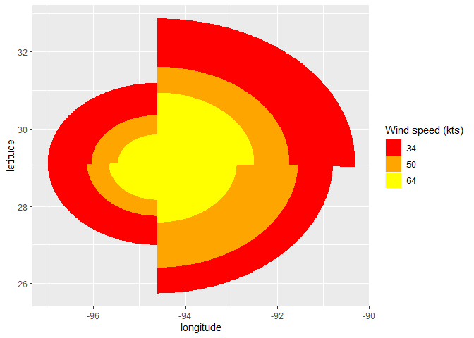
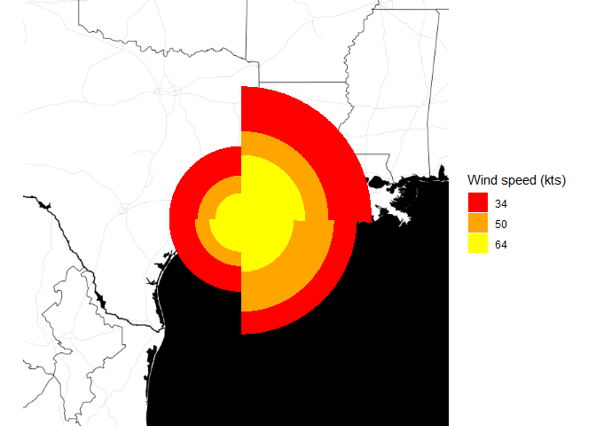
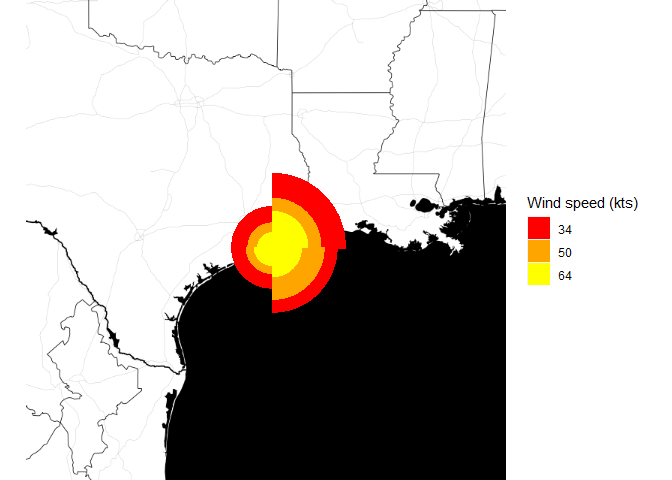
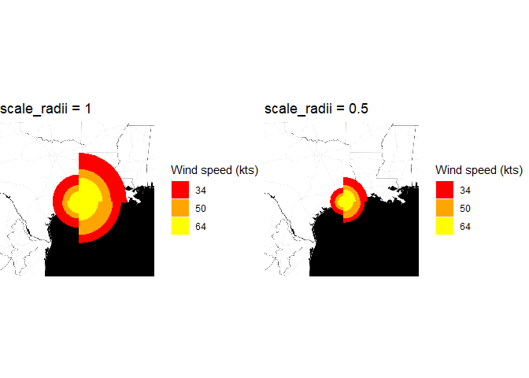

<!-- README.md is generated from README.Rmd. Please edit that file -->

# hurricanesotr

<!-- badges: start -->
<!-- badges: end -->

The goal of hurricanesotr is to provide tools to manipulate hurricanes
data. If given a database of recorded hurricanes, the hurricanesotr
package helps produce a single observation time dataset for any single
storm in the database. It is done by supplying to sotdfss function the
following arguments: name, year, month, day and hour. The default
database for storms is ext_tracks. A data downloaded from and cleaned by
a code provided in data-raw. wborder and wborders are the main functions
called by StatHurricane to transform the data. stat_hurricane and
geom_hurricane help plot the wind radii for single observation time
dataset as polygons

## Installation

You can install the development version of hurricanesotr like so:

``` r
install.packages("devtools")
library(devtools)
devtools::install_github("hugo7gpad/hurricanesotr")
```

## Example

This is a basic example which shows you how to get the single
observation time dataset for the storm KATRINA on August 29, 2005 at
12pm

``` r
library(hurricanesotr)
data("ext_tracks")
katrina <- sotdfss("KATRINA", 2005, "08", "29", "12")
#>       storm_id                date latitude longitude wind_speed  ne  nw  se
#> 1 KATRINA 2005 2005-08-29 12:00:00     29.5     -89.6         34 200 100 200
#> 2 KATRINA 2005 2005-08-29 12:00:00     29.5     -89.6         50 120  75 120
#> 3 KATRINA 2005 2005-08-29 12:00:00     29.5     -89.6         64  90  60  90
#>    sw
#> 1 150
#> 2  75
#> 3  60
katrina
#>       storm_id                date latitude longitude wind_speed  ne  nw  se
#> 1 KATRINA 2005 2005-08-29 12:00:00     29.5     -89.6         34 200 100 200
#> 2 KATRINA 2005 2005-08-29 12:00:00     29.5     -89.6         50 120  75 120
#> 3 KATRINA 2005 2005-08-29 12:00:00     29.5     -89.6         64  90  60  90
#>    sw
#> 1 150
#> 2  75
#> 3  60
```

Similarly, we can get the single observation time dataset for hurricane
IKE. But first, let’s get some information about its landfall. The
following code gives a simplified data for IKE

``` r
library(dplyr)
#> 
#> Attaching package: 'dplyr'
#> The following objects are masked from 'package:stats':
#> 
#>     filter, lag
#> The following objects are masked from 'package:base':
#> 
#>     intersect, setdiff, setequal, union
ike_simplData <- dplyr::filter(ext_tracks, storm_name == 'IKE',
                               year == 2008) %>%
  dplyr::select(month, day, hour, longitude, latitude,
                max_wind,eye_diameter, distance_to_land)
ike_simplData
#> # A tibble: 58 × 8
#>    month day   hour  longitude latitude max_wind eye_diameter distance_to_land
#>    <chr> <chr> <chr>     <dbl>    <dbl>    <dbl>        <dbl>            <dbl>
#>  1 09    01    06         37       17.2       30           NA             2100
#>  2 09    01    12         38.4     17.3       35           NA             2036
#>  3 09    01    18         39.9     17.5       45           NA             1946
#>  4 09    02    00         41.3     17.8       45           NA             1879
#>  5 09    02    06         42.8     18.2       45           NA             1811
#>  6 09    02    12         44.3     18.7       50           NA             1766
#>  7 09    02    18         45.8     19.3       55           NA             1747
#>  8 09    03    00         47.3     19.8       55           NA             1727
#>  9 09    03    06         48.8     20.2       55           NA             1673
#> 10 09    03    12         50.3     20.6       60           NA             1580
#> # … with 48 more rows
```

Using the variable distance_to_land, we notice that the storm was over
the United States for month = 09, day = 13, hour = 12. The nearest point
it was recorded before is for month = 09, day = 13, hour = 06. We are
going to use this nearest point as the landfall point of the storm IKE.
A google map search of the longitude( - 94.6) and latitude(29.1)
obtained indicates that the landfall occurred near Galveston, TEXAS. The
single observation time dataset at that moment will be:

``` r
ike <- sotdfss("IKE", 2008, "09", "13", "06")
#>   storm_id                date latitude longitude wind_speed  ne  nw  se  sw
#> 1 IKE 2008 2008-09-13 06:00:00     29.1     -94.6         34 225 125 200 125
#> 2 IKE 2008 2008-09-13 06:00:00     29.1     -94.6         50 150  75 160  80
#> 3 IKE 2008 2008-09-13 06:00:00     29.1     -94.6         64 110  45  90  55
ike
#>   storm_id                date latitude longitude wind_speed  ne  nw  se  sw
#> 1 IKE 2008 2008-09-13 06:00:00     29.1     -94.6         34 225 125 200 125
#> 2 IKE 2008 2008-09-13 06:00:00     29.1     -94.6         50 150  75 160  80
#> 3 IKE 2008 2008-09-13 06:00:00     29.1     -94.6         64 110  45  90  55
```

You can use geom_hurricane to plot wind radii for hurricane IKE

``` r
ggplot2::ggplot(data = ike) +
  geom_hurricane(ggplot2::aes(x = longitude, y = latitude, r_ne = ne, r_nw = nw, r_sw = sw,
                              r_se = se, fill = wind_speed, colour = wind_speed),
                 scale_radii = 1, np = 250) +
  ggplot2::scale_colour_manual(name = "Wind speed (kts)", values = c("red", "orange", 'yellow')) +
  ggplot2::scale_fill_manual(name = "Wind speed (kts)", values = c("red", "orange", 'yellow'))
```



You can also save the plot of wind radii for IKE:

    #> png 
    #>   2

You can also add that plot to a base map

``` r
library(ggmap)
#> Loading required package: ggplot2
#> ℹ Google's Terms of Service: <]8;;https://mapsplatform.google.comhttps://mapsplatform.google.com]8;;>
#> ℹ Please cite ggmap if you use it! Use `citation("ggmap")` for details.
map_data <- get_map("Galveston", zoom = 6, maptype = "toner-background")
#> ! `maptype = "toner-background"` is only available with `source = "stamen"`; resetting source.
#> ℹ <]8;;https://maps.googleapis.com/maps/api/staticmap?center=Galveston&zoom=6&size=640x640&scale=2&maptype=terrain&key=xxxhttps://maps.googleapis.com/maps/api/staticmap?center=Galveston&zoom=6&size=640x640&scale=2&maptype=terrain&key=xxx]8;;>
#> ℹ <]8;;https://maps.googleapis.com/maps/api/geocode/json?address=Galveston&key=xxxhttps://maps.googleapis.com/maps/api/geocode/json?address=Galveston&key=xxx]8;;>
#> ℹ Map tiles by Stamen Design, under CC BY 3.0. Data by OpenStreetMap, under ODbL.
base_map <- ggmap(map_data, extent = "device")

base_map +
  geom_hurricane(data = ike, ggplot2::aes(x = longitude, y = latitude, r_ne = ne, r_nw = nw, r_sw = sw,
                                              r_se = se, fill = wind_speed, colour = wind_speed),
                 scale_radii = 1, np = 250) +
  ggplot2::scale_colour_manual(name = "Wind speed (kts)", values = c("red", "orange", 'yellow')) +
  ggplot2::scale_fill_manual(name = "Wind speed (kts)", values = c("red", "orange", 'yellow'))
```



Now, we can you use the scale_radii parameter to plot the wind radii
only at 50%

``` r

# scale_radii = 0.5
 base_map +
  geom_hurricane(data = ike, ggplot2::aes(x = longitude, y = latitude, r_ne = ne, r_nw = nw, 
                                          r_sw = sw, r_se = se, fill = wind_speed,
                                          colour = wind_speed), scale_radii = 0.5, np = 250) +
  ggplot2::scale_colour_manual(name = "Wind speed (kts)", values = c("red", "orange",'yellow')) +
  ggplot2::scale_fill_manual(name = "Wind speed (kts)", values = c("red", "orange", 'yellow'))
```



Let’s compare this last plot to the plot with default value for
scale_radii, 1.

``` r
# Default: scale_radii = 1
defaultScaleRadii_1 <- base_map +
  geom_hurricane(data = ike, ggplot2::aes(x = longitude, y = latitude, r_ne = ne, r_nw = nw, r_sw = sw,
                                              r_se = se, fill = wind_speed, colour = wind_speed),
                 scale_radii = 1, np = 250) +
  ggplot2::scale_colour_manual(name = "Wind speed (kts)", values = c("red", "orange", 'yellow')) +
  ggplot2::scale_fill_manual(name = "Wind speed (kts)", values = c("red", "orange", 'yellow')) +
  labs(title = "scale_radii = 1")

# scale_radii = 0.5
scaleRadii_0.5 <- base_map +
  geom_hurricane(data = ike, ggplot2::aes(x = longitude, y = latitude, r_ne = ne, r_nw = nw, r_sw = sw,
                                              r_se = se, fill = wind_speed, colour = wind_speed),
                 scale_radii = 0.5, np = 250) +
  ggplot2::scale_colour_manual(name = "Wind speed (kts)", values = c("red", "orange", 'yellow')) +
  ggplot2::scale_fill_manual(name = "Wind speed (kts)", values = c("red", "orange", 'yellow')) +
  labs(title = "scale_radii = 0.5")

gridExtra::grid.arrange(defaultScaleRadii_1, scaleRadii_0.5, ncol = 2)
```


